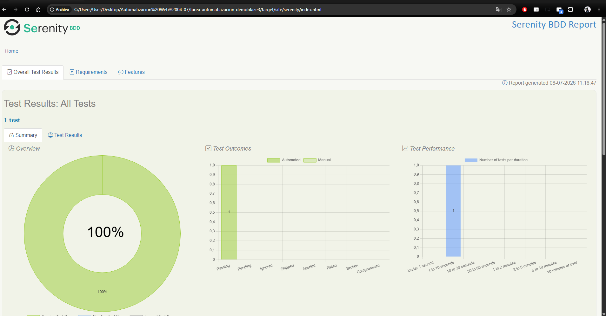
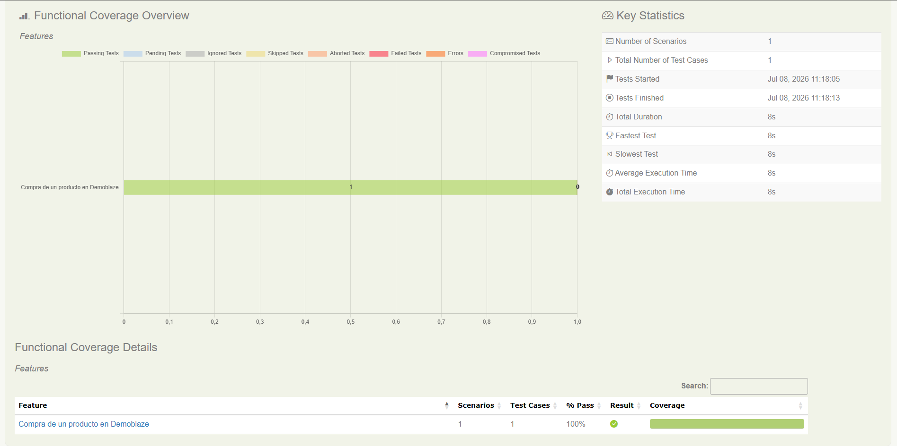

# 🛒 Automatización Web Demoblaze

Proyecto académico de automatización web realizado con **Java, Selenium WebDriver, Cucumber, JUnit, Serenity BDD y Screenplay**.

El objetivo de este proyecto es automatizar un flujo básico de compra en la página **Demoblaze**, validando que un usuario pueda iniciar sesión, seleccionar un producto, agregarlo al carrito y confirmar que el producto se visualice correctamente.

---

## 🚀 Tecnologías utilizadas


---

## 🌐 Página automatizada

🔗 https://www.demoblaze.com/

---

## 🧪 Flujo automatizado

El escenario automatizado realiza el siguiente flujo:

1. Abrir la página de Demoblaze.
2. Iniciar sesión con un usuario válido.
3. Seleccionar el producto **Samsung Galaxy S6**.
4. Agregar el producto al carrito.
5. Aceptar la alerta de confirmación.
6. Ingresar al carrito.
7. Validar que el producto se encuentre agregado correctamente.

---

## 📝 Escenario en Gherkin

```gherkin
Feature: Compra de un producto en Demoblaze

  Scenario: Login y agregar un producto al carrito
    Given que el usuario abre la página de Demoblaze
    When inicia sesión con su usuario y contraseña
    And selecciona el producto Samsung Galaxy S6
    And agrega el producto al carrito
    And ingresa al carrito
    Then debería visualizar el producto agregado
```

---

## ▶️ Ejecución del proyecto

Para ejecutar la automatización desde la terminal, ubicarse en la raíz del proyecto y ejecutar:

```bash
mvn clean verify
```

También se puede ejecutar desde IntelliJ IDEA haciendo clic derecho sobre la clase:

```text
CompraRunner.java
```

y seleccionando:

```text
Run 'CompraRunner'
```

---

## 📊 Reporte Serenity

Luego de ejecutar el proyecto, Serenity genera un reporte HTML con el detalle de la ejecución.

Ruta del reporte:

```text
target/site/serenity/index.html
```

El reporte permite visualizar:

- Estado general de la prueba.
- Escenario ejecutado.
- Pasos realizados.
- Evidencias capturadas.
- Resultado final de la automatización.

---

## 📸 Evidencia de ejecución

A continuación se muestra la evidencia del reporte generado por **Serenity BDD**, donde se observa que la prueba fue ejecutada correctamente.




---

## ✅ Resultado obtenido

La automatización finalizó correctamente:

```text
1 test executed
100% passing
```

Esto confirma que el producto **Samsung Galaxy S6** fue agregado correctamente al carrito y validado en la página de Demoblaze.

---

## 📌 Buenas prácticas aplicadas

- Uso de **Serenity BDD** con el patrón **Screenplay**.
- Escenario escrito en lenguaje **Gherkin** con Cucumber.
- Automatización web con **Selenium WebDriver**.
- Separación de responsabilidades mediante **Tasks**, **Questions** y **User Interfaces**.
- Uso de esperas explícitas para mejorar la estabilidad de la prueba.
- Manejo de alerta JavaScript al agregar el producto al carrito.
- Generación automática de reporte HTML con Serenity.

---

## 👨‍💻 Autor

**Rodolfo Coria**  
Proyecto académico de Automatización Web QA.
